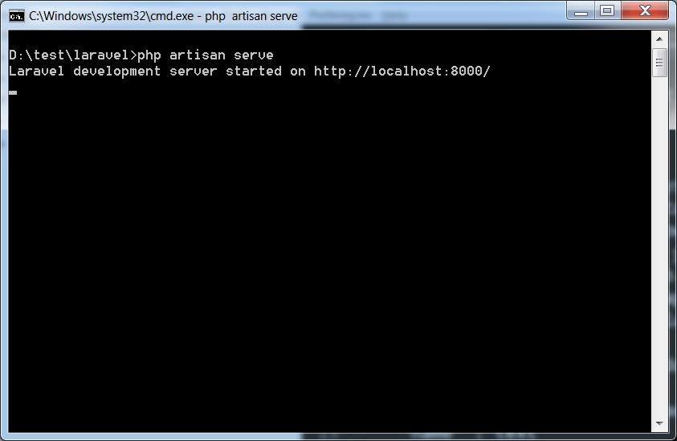
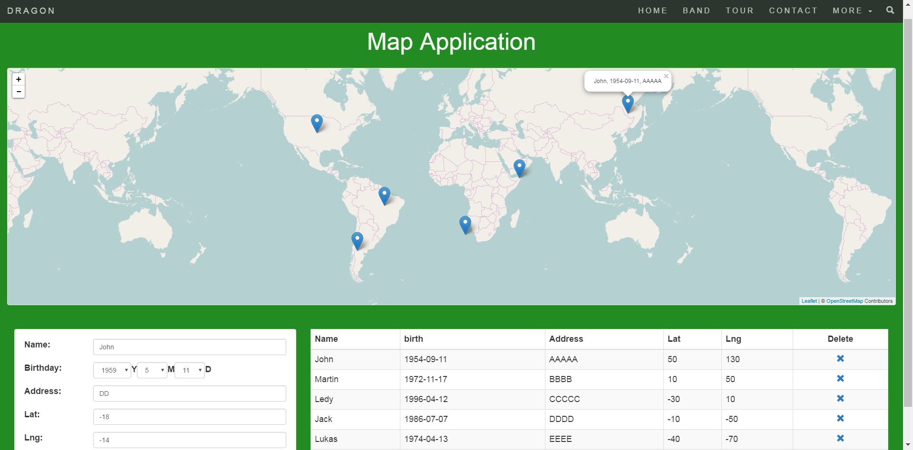

# Leaflet demo using Laravel and AngularJS
This is a map application that I built using AngularJS, Leaflet.js and Laravel Framework.

# User Guide
1. Install composer on your system.
Download composer and install it on your system.
    https://getcomposer.org/download/
2. Clone this project code on your system.
```
$ git clone https://github.com/dragon306/angular-laravel-leaflet.git mapApp
```
3. Create a database called "laravel" and create a table called "users" using phpMyAdmin.
"id", "name", "birth", "address", "lat", "lng" fields should be in "users" table.
* "id" : int, primary key, auto increment
* "name" : text
* "birth" : date
* "address" : text
* "lat" : int
* "lng" : int
4. Run the project on your localhost.
* ```$ cd mapApp```
* ```$ php artisan serve```
5. After executing the above command, you will see a screen as shown below:

6. Copy the url in the above screenshot and open the url in the browser. If you see the following screen, it implies the project has been installed successfully.

